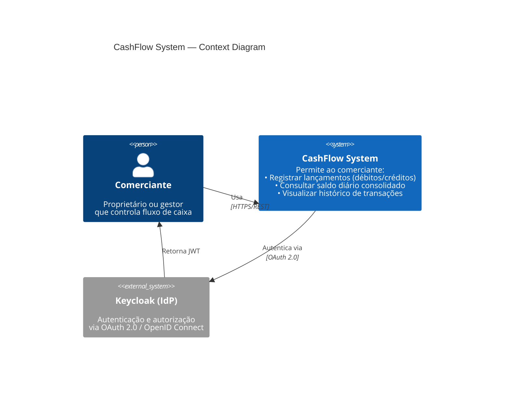

# 01 — Context Diagram (C4 Level 1)

## Visão Geral

O **Context Diagram** é a visão de mais alto nível da arquitetura. Mostra:
- Um ator principal: o **Comerciante**
- Um sistema central: o **CashFlow System** (como uma caixa preta)
- Um sistema externo: o **Keycloak** (Identity Provider)
- As interações entre eles

Este diagrama não expõe detalhes internos — apenas comunica o contexto geral do sistema.

---

## Diagrama



---

## Descrição dos Elementos

### Ator: Comerciante
- **Papel:** Usuário do sistema
- **Atividades principais:**
  - Registra novos lançamentos (débito ou crédito)
  - Consulta o saldo consolidado diário
  - Visualiza histórico de transações em um período
  - Autentica-se via OAuth 2.0 (Keycloak)

### Sistema Central: CashFlow System
- **Responsabilidade:** Controle de fluxo de caixa
- **Capacidades:**
  - Ingestão de lançamentos (débitos e créditos)
  - Consolidação diária de saldo
  - Consulta de histórico de transações
  - Autenticação e autorização

**Nota:** O sistema é mostrado como uma caixa preta — detalhes internos (APIs, workers, bancos de dados) serão mostrados no próximo nível (Container Diagram).

### Sistema Externo: Keycloak
- **Responsabilidade:** Gerenciamento de identidade e acesso
- **Padrão:** OAuth 2.0 + OpenID Connect
- **Fluxo:**
  1. Comerciante faz login no Keycloak
  2. Keycloak retorna um JWT (JSON Web Token)
  3. JWT é enviado em toda requisição para o CashFlow System
  4. CashFlow System valida o JWT e autoriza a ação

---

## Fluxos de Interação (Alto Nível)

### Fluxo 1: Autenticação
```
Comerciante → Keycloak: POST /realms/cashflow/protocol/openid-connect/token
Keycloak → Comerciante: JWT (access token + refresh token)
Comerciante → CashFlow: GET /api/v1/transactions (com Authorization: Bearer JWT)
```

### Fluxo 2: Registrar Lançamento
```
Comerciante → CashFlow: POST /api/v1/transactions
  {
    "type": "CREDIT|DEBIT",
    "amount": decimal,
    "description": string,
    "category": string,
    "date": date
  }
CashFlow → Comerciante: 201 Created (ou 400/401/403 em caso de erro)
```

### Fluxo 3: Consultar Saldo Diário
```
Comerciante → CashFlow: GET /api/v1/consolidation/daily?date=YYYY-MM-DD
CashFlow → Comerciante: 200 OK
  {
    "date": "2024-03-15",
    "totalCredits": 1500.00,
    "totalDebits": 800.50,
    "balance": 699.50,
    "transactionCount": 12
  }
```

---

## Relacionamentos

| De | Para | Descrição | Tecnologia |
|----|------|-----------|-----------|
| Comerciante | CashFlow System | Utiliza a aplicação | HTTPS/REST |
| CashFlow System | Keycloak | Valida tokens e autoriza usuários | OAuth 2.0 + JWT |
| Keycloak | Comerciante | Retorna credenciais após autenticação bem-sucedida | JWT |

---

## Notas Importantes

1. **Segurança:** Toda comunicação com o CashFlow System requer autenticação via JWT (emitido por Keycloak)
2. **Isolamento:** O Keycloak é um sistema completamente externo — falhas no Keycloak podem impedir login, mas o CashFlow continua operando
3. **Próximo nível:** O Container Diagram (próximo documento) detalha como o CashFlow System está internamente estruturado (APIs, workers, bancos de dados, cache, broker de eventos)

---

**Próximo documento:** `docs/architecture/02-container-diagram.md` (detalhes internos do CashFlow System)
