# 02 — Container Diagram (C4 Level 2)

## Visão Geral

O **Container Diagram** detalha a estrutura interna do **CashFlow System**. Mostra:
- **5 containers de aplicação** (.NET 8 APIs, Workers)
- **3 data stores** (MongoDB, IMemoryCache, RabbitMQ)
- **1 Identity Provider** (Keycloak)
- **Stack de observabilidade** (OTel, Jaeger, Prometheus, Grafana, Seq)
- **3 limites de rede** (frontend, backend, monitoring)
- **Fluxos de dados** (síncrono e assíncrono)

Um "container" aqui é um processo executável ou microserviço — algo que pode ser deployado independentemente.

> **Nota importante:** A arquitetura usa **IMemoryCache (.NET in-process)** como cache padrão no MVP. Redis está disponível na infraestrutura para evolução futura (Phase 2).

---

## Diagrama

```mermaid
C4Container
    title CashFlow System — Container Diagram
    
    Person(merchant, "Comerciante", "Acessa via navegador ou cliente REST")
    
    System_Boundary("frontend-net", "Frontend Network") {
        Container(gateway, "API Gateway", "YARP (.NET 8)", "• Ponto de entrada único<br/>• Rate limiting (100 req/s)<br/>• Auth middleware (JWT validation)<br/>• Roteamento para downstream services")
    }
    
    System_Boundary("backend-net", "Backend Network") {
        Container(transapi, "Transactions API", ".NET 8 Minimal API", "• POST /transactions (criar lançamento)<br/>• GET /transactions (listar por período)<br/>• MediatR CQRS<br/>• MongoDB Outbox Pattern")
        
        Container(transworker, "Transactions.Worker", ".NET 8 BackgroundService", "• BatcherBackgroundService (polling)<br/>• MassTransit Consumer<br/>• Batch processing (RawRequest → Transaction)<br/>• Publica TransactionCreated event")
        
        Container(consapi, "Consolidation API", ".NET 8 Minimal API", "• GET /consolidation/daily<br/>• Cache-First (IMemoryCache)<br/>• MongoDB fallback (cache miss)<br/>• TTL 5 minutos")
        
        Container(consworker, "Consolidation.Worker", ".NET 8 BackgroundService", "• 2 MassTransit Consumers<br/>• TransactionCreatedConsumer<br/>• ConsolidationBatchReceivedConsumer<br/>• Batch processing de consolidações")
        
        ContainerDb(mongodb, "MongoDB 7.0", "Database", "• transactions_db<br/>  ├─ raw_requests<br/>  ├─ transactions<br/>  └─ outbox<br/>• consolidation_db<br/>  ├─ daily_consolidations<br/>  └─ processed_events")
        
        ContainerDb(memcache, "IMemoryCache", "Cache (In-Process)", "• Consolidação cache (TTL 5min)<br/>• Chave: consol:{date}<br/>• < 50ms latência<br/>• Per-instance (não compartilhado)")
        
        ContainerDb(rabbitmq, "RabbitMQ 3.13", "Message Broker", "• Topic: cashflow.transactions<br/>• Topic: cashflow.consolidation<br/>• Routing keys: transaction.created<br/>• DLQ para análise de falhas<br/>• Prometheus metrics enabled")
    }
    
    System_Boundary("keycloak-net", "Identity Provider Network") {
        Container(keycloak, "Keycloak 24.0", "Identity Provider", "• OAuth 2.0 + OpenID Connect<br/>• RBAC: transactions:read/write, consolidation:read<br/>• JWT tokens (1h expiry)<br/>• Refresh tokens (7d expiry)")
    }
    
    System_Boundary("monitoring-net", "Monitoring Network") {
        Container(otel, "OTel Collector", "Observability", "• Coleta traces (OTLP gRPC)<br/>• Coleta logs estruturados<br/>• Coleta métricas<br/>• Exporta para Jaeger, Seq, Prometheus")
        
        Container(jaeger, "Jaeger UI", "Distributed Tracing", "• Visualiza traces distribuídos<br/>• Armazena spans em badger<br/>• Análise de latência")
        
        Container(prometheus, "Prometheus", "Time-Series Metrics", "• Scrape de métricas (9090)<br/>• Retenção: 7 dias<br/>• Targets: APIs, RabbitMQ, Redis")
        
        Container(grafana, "Grafana", "Visualization", "• Dashboards de métricas<br/>• Fonte de dados: Prometheus<br/>• Alertas configurados")
        
        Container(seq, "Seq", "Structured Logging", "• Coleta logs estruturados em JSON<br/>• Busca full-text<br/>• Alertas baseados em padrões")
    }
    
    System_Ext(browser, "Browser / REST Client", "Aplicação do comerciante")
    
    Rel(merchant, browser, "Acessa via")
    
    Rel(browser, gateway, "HTTP/HTTPS", "REST APIs")
    
    Rel(gateway, transapi, "Rota para /transactions", "HTTP 8080")
    Rel(gateway, consapi, "Rota para /consolidation", "HTTP 8080")
    Rel(gateway, keycloak, "Valida token com", "OAuth 2.0")
    
    Rel(transapi, mongodb, "Persiste lançamentos + outbox", "MongoDB driver")
    Rel(transapi, otel, "Envia spans + métricas", "OTLP gRPC")
    
    Rel(transworker, mongodb, "Busca raw_requests + persiste transactions", "MongoDB driver")
    Rel(transworker, rabbitmq, "Publica TransactionBatchReady + TransactionCreated", "AMQP")
    Rel(transworker, otel, "Envia spans + métricas", "OTLP gRPC")
    
    Rel(consapi, memcache, "Busca cache (hit)", "In-process")
    Rel(consapi, mongodb, "Busca DB (miss)", "MongoDB driver")
    Rel(consapi, otel, "Envia spans + métricas", "OTLP gRPC")
    
    Rel(consworker, rabbitmq, "Consome TransactionCreated + ConsolidationBatchReceived", "AMQP")
    Rel(consworker, mongodb, "Lê/escreve consolidações + idempotência", "MongoDB driver")
    Rel(consworker, otel, "Envia spans + métricas", "OTLP gRPC")
    
    Rel(consapi, rabbitmq, "Consome DailyConsolidationUpdated (cache invalidation)", "AMQP")
    
    Rel(otel, jaeger, "Exporta traces")
    Rel(otel, seq, "Exporta logs")
    Rel(otel, prometheus, "Exporta métricas")
    
    Rel(prometheus, grafana, "Scrape de métricas")
```



---

## Descrição Detalhada dos Containers

### Containers de Aplicação

#### 1. API Gateway (YARP)
**Responsabilidade:** Ponto de entrada único, roteamento, segurança

- **Tecnologia:** YARP (Yet Another Reverse Proxy) em .NET 8
- **Porta:** 8080 (exposto em 8080:8080)
- **Funcionalidades:**
  - Rate limiting: 100 req/s (global por IP)
  - Validação de JWT (Authorization header)
  - Roteamento para serviços downstream
  - Logs de requisição
  - Tracing OpenTelemetry
- **Dependências:**
  - Keycloak (validação de tokens)
  - Transactions API (downstream)
  - Consolidation API (downstream)

**SLA:** 99.99% uptime (4s downtime/mês)

---

#### 2. Transactions API
**Responsabilidade:** Ingestão de lançamentos (débitos/créditos)

- **Tecnologia:** .NET 8 Minimal APIs
- **Porta:** 8080 (exposto em 8081:8080 no docker-compose)
- **Endpoints:**
  - `POST /api/v1/transactions` — Criar lançamento
  - `GET /api/v1/transactions` — Listar por período (paginado)
  - `GET /api/v1/transactions/{id}` — Detalhes de uma transação
- **Padrão:** Outbox Pattern
  - Insert em `transactions` collection
  - Insert em `outbox` collection (para garantir publicação)
  - Ambos em mesma transação MongoDB
  - Publicação para RabbitMQ após commit
- **Cache:** Não usa (dados mutáveis)
- **Dependências:**
  - MongoDB (transactions_db)
  - RabbitMQ (publicar eventos)
  - OTel Collector (tracing/métricas)

**SLA:** 99.9% uptime (43s downtime/mês)

**Latência:**
- p50: ≤ 200ms
- p95: ≤ 1000ms
- p99: ≤ 2000ms

**Throughput:** ≥ 100 req/s

---

#### 3. Transactions.Worker
**Responsabilidade:** Processamento em batch de lançamentos (transações)

- **Tecnologia:** .NET 8 BackgroundService + MassTransit
- **Padrão:** Dois estágios de batch processing
  - **Estágio 1:** BatcherBackgroundService (polling)
    - Busca RawRequests pendentes (timeout: 5 min, batch size: 100)
    - Usa distributed lock para apenas uma instância processar
    - Publica `TransactionBatchReadyEvent`
  - **Estágio 2:** TransactionBatchReadyConsumer (MassTransit)
    - Consome `TransactionBatchReadyEvent`
    - Converte RawRequest → Transaction
    - Publica `TransactionCreatedEvent` para downstream (Consolidation Worker)
- **Idempotência:** Rastreamento de batches processados
- **Dependências:**
  - MongoDB (transactions_db)
  - RabbitMQ (publicação de eventos)
  - OTel Collector (tracing/métricas)

**Resiliência:**
- Distributed lock (MongoDB) previne race conditions entre múltiplas instâncias
- Se RabbitMQ falha: RawRequests permanecem pendentes para retry
- Se MongoDB falha: batch fica em PENDING até retry bem-sucedido

---

#### 4. Consolidation API
**Responsabilidade:** Leitura de saldo consolidado diário (Cache-First)

- **Tecnologia:** .NET 8 Minimal APIs
- **Porta:** 8080 (exposto em 8082:8080 no docker-compose)
- **Endpoints:**
  - `GET /api/v1/consolidation/daily?date=YYYY-MM-DD` — Saldo de data específica
  - `GET /api/v1/consolidation/daily/{date}` — Versão alternativa
- **Padrão:** Cache-First com IMemoryCache
  1. Busca em IMemoryCache (TTL 5min, in-process)
  2. Se HIT: retorna imediatamente (< 50ms)
  3. Se MISS: busca em MongoDB, armazena em IMemoryCache, retorna
- **Dependências:**
  - IMemoryCache (cache in-process)
  - MongoDB (consolidation_db)
  - OTel Collector (tracing/métricas)

**SLA:** 99.5% uptime (3.6min downtime/mês)

**Latência:**
- Cache HIT: < 50ms
- Cache MISS: 200-500ms
- p95: ≤ 500ms
- p99: ≤ 1500ms

**Throughput:** ≥ 50 req/s (crítico)

---

#### 5. Consolidation.Worker
**Responsabilidade:** Processamento assíncrono de consolidações (dois estágios)

- **Tecnologia:** .NET 8 BackgroundService + MassTransit
- **Padrão:** Dois estágios de consumo
  - **Estágio 1:** TransactionCreatedConsumer
    - Consome `TransactionCreatedEvent` (tópico: cashflow.transactions)
    - Acumula em lote (IngestTransactionsBatch)
    - Publica `ConsolidationBatchReceivedEvent`
  - **Estágio 2:** ConsolidationBatchReceivedConsumer
    - Consome `ConsolidationBatchReceivedEvent` (tópico: cashflow.consolidation)
    - Processa consolidações: `balance = sum(credits) - sum(debits)`
    - UPSERT em `consolidation_db.daily_consolidations`
    - Publica `DailyConsolidationUpdatedEvent` (para Consolidation API invalidar cache)
- **Idempotência:** Armazenamento de evento-processado em `processed_events` (TTL 7 dias)
- **Dependências:**
  - RabbitMQ (consumer)
  - MongoDB (consolidation_db)
  - OTel Collector (tracing/métricas)

**Resiliência:**
- Se RabbitMQ falha: mensagens ficam enfileiradas
- Se MongoDB falha: retry com backoff exponencial (até DLQ)
- Idempotência garante safety em reprocessamento

---

### Data Stores

#### MongoDB 7.0
**Responsabilidade:** Persistência de dados estruturados

- **Imagem:** mongo:7.0
- **Autenticação:** MONGO_INITDB_ROOT_USERNAME/PASSWORD
- **Limite de memória:** 512M
- **Databases:**
  - `transactions_db` — Dados de lançamentos
    - Collection: `transactions`
      - `_id` (ObjectId)
      - `userId` (String — extraído do JWT, identifica o autor do lançamento)
      - `type` (DEBIT|CREDIT)
      - `amount` (Decimal128)
      - `description` (String)
      - `category` (String)
      - `date` (Date)
      - `createdAt` (Timestamp)
      - `updatedAt` (Timestamp)
      - Índice: `date` + `type`
      - Índice: `userId` (para consultas de auditoria por usuário)
    - Collection: `outbox` (Outbox Pattern)
      - Armazena eventos aguardando publicação
  - `consolidation_db` — Dados de consolidação
    - Collection: `daily_consolidation`
      - `date` (Date, unique)
      - `totalCredits` (Decimal128)
      - `totalDebits` (Decimal128)
      - `balance` (Decimal128, calculado)
      - `transactionCount` (Int32)
      - `lastUpdated` (Timestamp)
      - Índice: `date` (unique)
- **Backup:** Volumes nomeados (persistem além de `docker compose down`)

---

#### IMemoryCache (.NET)
**Responsabilidade:** Cache de leitura rápida (in-process)

- **Tecnologia:** `Microsoft.Extensions.Caching.Memory` (built-in no .NET)
- **Configuração:**
  - TTL: 5 minutos (configurável)
  - Política: No eviction (cache é local por instância)
  - Armazenamento: RAM da aplicação
- **Estrutura de chaves:**
  - `consol:{date}` → DailyConsolidationResponse (JSON serializado)
  - Formato chave: `consol:2024-03-15`
- **Limitações vs Redis:**
  - ✅ Rápido: < 50ms para leitura
  - ❌ Não compartilhado entre instâncias (se houver múltiplas replicas, cada uma tem seu cache)
  - ❌ Perdido ao reiniciar container
- **Evolução:** Em produção com múltiplas réplicas, considerar Redis (see ADR-008)

---

#### RabbitMQ 3.13
**Responsabilidade:** Broker de eventos assíncrono

- **Imagem:** rabbitmq:3.13-management-alpine
- **Management UI:** Port 15672
- **Prometheus metrics:** Port 15692
- **Configuração:**
  - Single-node (dev/test)
  - Autenticação: RABBITMQ_DEFAULT_USER/PASS
  - Limite de memória: 512M
- **Topologia:**
  - **Exchange:** `events` (type: topic)
  - **Queues:**
    - `transaction.created` — Events do Transactions Service
    - `consolidation.input` — Input para o Worker
    - Dead Letter Exchanges/Queues para retry
  - **Bindings:**
    - `transaction.created` → `consolidation.input` (Consolidation Worker consome)
- **Padrão:** At-least-once delivery com idempotência no consumer

---

### Identity Provider

#### Keycloak 24.0
**Responsabilidade:** Autenticação e autorização centralizadas

- **Imagem:** quay.io/keycloak/keycloak:24.0
- **Banco de dados:** PostgreSQL 16 (separado)
- **Porta:** 8080 (exposto em 8443:8080 no docker-compose — NOTA: porta interna é 8080, não HTTPS)
- **Configuração:**
  - Realm: `cashflow`
  - Usuarios: Admin (KEYCLOAK_ADMIN/KEYCLOAK_ADMIN_PASSWORD)
  - Clients: cashflow-api
- **Suporte:**
  - OAuth 2.0 Authorization Code Flow
  - OpenID Connect
  - RBAC (Roles): transactions:read, transactions:write, consolidation:read, admin
- **Tokens:**
  - JWT access token: 1 hora de validade
  - Refresh token: 7 dias de validade

---

### Stack de Observabilidade

#### OTel Collector
**Responsabilidade:** Coleta centralizada de sinais observabilidade

- **Imagem:** otel/opentelemetry-collector-contrib:0.98.0
- **Portas:**
  - 4317: OTLP gRPC (input das aplicações)
  - 4318: OTLP HTTP (alternativa)
  - 8889: Prometheus exporter (para Prometheus scrape)
- **Fluxo:**
  - Aplicações enviam traces via OTLP gRPC
  - OTel Collector processa e enriquece spans
  - Exporta para Jaeger (traces), Seq (logs), Prometheus (métricas)

#### Jaeger UI
**Responsabilidade:** Visualização de traces distribuídos

- **Imagem:** jaegertracing/all-in-one:1.56
- **Porta:** 16686 (UI)
- **Armazenamento:** Badger (embedded key-value store)
- **Uso:**
  - Buscar traces por traceId, serviço, operação
  - Analisar latência entre spans
  - Identificar gargalos em fluxos assíncrono

#### Prometheus
**Responsabilidade:** Coleta e armazenamento de métricas

- **Imagem:** prom/prometheus:v2.51.0
- **Porta:** 9090
- **Configuração:**
  - Retention: 7 dias
  - Scrape interval: 15s
  - Targets:
    - APIs (.NET 8 /metrics)
    - RabbitMQ (15692)
    - Redis (exporters)
    - OTel Collector (8889)

#### Grafana
**Responsabilidade:** Visualização de dashboards

- **Imagem:** grafana/grafana:10.4.2
- **Porta:** 3000
- **Fonte de dados:** Prometheus
- **Dashboards:** Provisioning automático a partir de `/etc/grafana/provisioning`

#### Seq
**Responsabilidade:** Armazenamento e busca de logs estruturados

- **Imagem:** datalust/seq:2024.2
- **Porta:** 8341 (UI)
- **Entrada:** OTLP via OTel Collector
- **Formato:** JSON estruturado
- **Uso:**
  - Busca full-text de logs
  - Alertas baseados em padrões

---

## Fluxos de Dados

### Fluxo 1: Criar Lançamento (Happy Path)

```
1. Comerciante
   └─ POST /api/v1/transactions (com JWT)

2. API Gateway
   ├─ Rate limit: verifica limite (100 req/s)
   ├─ Auth: valida JWT com Keycloak
   └─ Rota: encaminha para Transactions API

3. Transactions API
   ├─ Valida input (amount > 0, description não vazio, etc.)
   ├─ BEGIN TRANSACTION MongoDB
   ├─ INSERT em transactions_db.transactions
   ├─ INSERT em transactions_db.outbox (evento TransactionCreated)
   ├─ COMMIT TRANSACTION
   └─ RETURN 201 Created

4. Outbox Publisher (background)
   ├─ Lê evento do outbox
   ├─ PUBLISH em RabbitMQ (exchange: events, routing_key: transaction.created)
   └─ DELETE do outbox

5. RabbitMQ
   └─ Armazena mensagem na fila consolidation.input

6. Consolidation Worker (consome)
   ├─ Consome mensagem
   ├─ Idempotency check (já foi processado?)
   ├─ Busca todas as transações da data em transactions_db
   ├─ Calcula balance = sum(credits) - sum(debits)
   ├─ UPSERT em consolidation_db.daily_consolidation
   ├─ DELETE cache em Redis: consolidation:2024-03-15
   ├─ ACK mensagem
   └─ Consolidado atualizado!

Duração típica: T0 a T0+500ms (inclusve processamento assíncrono)
```

---

### Fluxo 2: Consultar Saldo Consolidado (Cache HIT)

```
1. Comerciante
   └─ GET /api/v1/consolidation/daily?date=2024-03-15 (com JWT)

2. API Gateway
   ├─ Rate limit: verifica (100 req/s)
   ├─ Auth: valida JWT
   └─ Rota: encaminha para Consolidation API

3. Consolidation API (Cache-First)
   ├─ ConsolidationService.GetDailyAsync()
   ├─ IMemoryCache.GetAsync(key: "consol:2024-03-15")
   ├─ HIT! Cache encontrado (TTL 5min)
   ├─ Retorna DailyConsolidationResponse
   └─ RETURN 200 OK

Duração: < 50ms (lookup in-process)
```

---

### Fluxo 3: Consultar Saldo Consolidado (Cache MISS)

```
1-2. (Igual ao fluxo anterior até Consolidation API)

3. Consolidation API (Cache-First)
   ├─ IMemoryCache.GetAsync(key)
   ├─ MISS! Cache expirou ou nunca foi armazenado
   ├─ MongoConsolidationRepository.GetByDateAsync("2024-03-15")
   ├─ Encontrou resultado em MongoDB
   ├─ IMemoryCache.SetAsync(key, value, ttl: 5min)
   ├─ Retorna DailyConsolidationResponse
   └─ RETURN 200 OK

Duração: 200-500ms (query MongoDB + serialização + cache set)
```

---

## Limites de Rede

### Frontend Network (`frontend-net`)
- **Quem está:** API Gateway
- **Acesso:** Comerciante via HTTPS (porta 8080)
- **Propósito:** Isolamento: apenas ponto de entrada público

### Backend Network (`backend-net`)
- **Quem está:** Transactions API, Consolidation API, Worker, MongoDB, Redis, RabbitMQ, OTel Collector
- **Acesso:** Apenas entre serviços internos
- **Segurança:** Sem acesso direto de fora

### Monitoring Network (`monitoring-net`)
- **Quem está:** Jaeger, Prometheus, Grafana, Seq, OTel Collector
- **Acesso:** Acesso externo apenas para dashboards (Grafana:3000, Jaeger:16686)
- **Propósito:** Observabilidade isolada

---

## Isolamento de Falhas

| Cenário | Transactions API | Transactions.Worker | Consolidation API | Consolidation.Worker | Resultado |
|---------|-----------------|---------------------|------------------|---------------------|-----------|
| Transactions.Worker DOWN | ✅ 100% | ❌ DOWN | ✅ 100% | ⚠️ Sem eventos | Lançamentos criados, consolidado desatualizado até worker voltar |
| Consolidation.Worker DOWN | ✅ 100% | ✅ 100% | ✅ 100% | ❌ DOWN | Lançamentos processados, consolidado desatualizado até worker voltar |
| IMemoryCache (in-process) | ✅ 100% | ✅ 100% | ⚠️ Degradado | ✅ 100% | Consolidation API mais lenta (300-500ms vs <50ms) — queries MongoDB |
| MongoDB DOWN | ❌ Falha | ❌ Falha | ❌ Falha | ❌ Falha | Sistema indisponível (SPOF em MVP) |
| RabbitMQ DOWN | ✅ (202 Accepted) | ⚠️ Sem msgs | ⚠️ Sem msgs | ⚠️ Sem msgs | Lançamentos aceitos, mas não processados até RabbitMQ voltar |

**Padrão:** Circuit breaker + bulkhead + timeout para resiliência adicional

---

## Próximos Níveis

- **C4 Level 3 (Component Diagrams):** Mostrarão a estrutura interna de cada serviço
  - Transactions API: Controllers, Services, Repositories, Domain Models
  - Consolidation API: Controllers, Services, Cache Layer, Repositories
  - Worker: Consumer pattern, Domain Services, Repositories
  
- **Fluxos de Sequência:** Diagramas de interação passo-a-passo para cenários críticos

---

**Próximo documento:** `docs/architecture/03-component-transactions.md` (C4 Level 3 — Transactions Service)
