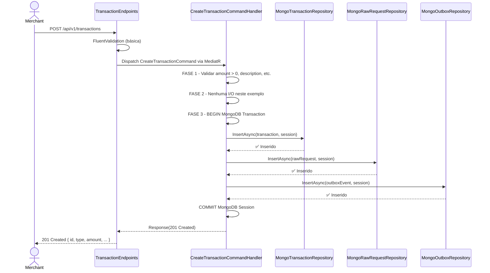

# 03 — Component Diagram: Transactions Service (C4 Level 3)

## Visão Geral

O **Transactions Service** é responsável por registrar e consultar lançamentos financeiros (débitos e créditos). Este diagrama detalha os **componentes internos** do serviço, suas responsabilidades e como se relacionam.

A arquitetura segue um modelo **Clean Architecture simplificado** com três camadas:
- **API Layer** — Endpoints, validação, serialização
- **Application Layer** — Orquestração via MediatR (CQRS)
- **Infrastructure Layer** — Persistência via MongoDB

---

## Diagrama

```mermaid
C4Component
    title Transactions API — Component Diagram (C4 Level 3)

    Container_Boundary(transapi, "Transactions API (.NET 8)") {

        Component(endpoints, "TransactionEndpoints", "Minimal API", "Define rotas HTTP:\n• POST /api/v1/transactions\n• GET /api/v1/transactions\n• GET /api/v1/transactions/{id}\nMapeia request → command/query → response")

        Component(validator, "InputValidator", "FluentValidation", "Valida regras de negócio:\n• amount > 0\n• description obrigatório (≤500 chars)\n• category: enum válido\n• date não pode ser futura")

        Component(createcmd, "CreateTransactionCommand", "MediatR IRequest", "Record imutável com TracerId\n+ command properties\nImplementa IRequest<Response>")

        Component(createhandler, "CreateTransactionCommandHandler", "MediatR IRequestHandler", "Orquestra atomicidade:\n3 fases (Validate→Resolve→Persist)\nRetorna Response com status")

        Component(getquery, "GetTransactionByIdQuery", "MediatR IRequest", "Query para leitura por ID\nImplementa IRequest<Response>")

        Component(gethandler, "GetTransactionByIdQueryHandler", "MediatR IRequestHandler", "Busca transação do MongoDB\nRetorna TransactionResponse ou 404")

        Component(listquery, "ListTransactionsQuery", "MediatR IRequest", "Query com paginação\nFiltros: date range, type")

        Component(listhandler, "ListTransactionsQueryHandler", "MediatR IRequestHandler", "Busca lote com paginação\nRetorna PagedResult<TransactionDto>")

        Component(domain, "Transaction", "Domain Aggregate Root", "Entidade raiz do aggregate:\n• Id, UserId, Type, Amount\n• Description, Category, Date\n• CreatedAt, UpdatedAt\nRegras de negócio encapsuladas")

        Component(itxrepo, "ITransactionRepository", "Interface", "Abstração de persistência:\n• InsertAsync (batch)\n• GetByIdAsync\n• GetByPeriodAsync (paginado)\n• ExistsAsync")

        Component(txrepo, "MongoTransactionRepository", "Infrastructure", "Implementação MongoDB:\n• Collection: transactions\n• Usa MongoDB driver C#\n• Index: date + type\n• Decimal128 para amount")

        Component(rawreqrepo, "IRawRequestRepository", "Interface", "Abstração de RawRequest:\n• InsertAsync (batch)\n• GetPendingAsync\n• MarkAsProcessedAsync")

        Component(rawreqimpl, "MongoRawRequestRepository", "Infrastructure", "Implementação MongoDB:\n• Collection: raw_requests\n• Status tracking (PENDING→PROCESSED)\n• Batch tagging")

        Component(outboxrepo, "IOutboxRepository", "Interface", "Abstração de Outbox:\n• InsertAsync\n• GetPendingAsync (batch)\n• MarkPublishedAsync")

        Component(outboximpl, "MongoOutboxRepository", "Infrastructure", "Implementação MongoDB:\n• Collection: outbox\n• Status: PENDING → PUBLISHED\n• MassTransit integration")

        Component(mediator, "IMediator", "MediatR Service", "Orquestrador de commands/queries\nResolve handlers via DI\nDispatch e retorna Response")

        Component(transactionservice, "TransactionService", "Application Service", "Legacy/Wrapper (se necessário):\nDelega para MediatR handlers\nOpcional conforme arquitetura")
    }

    ContainerDb(mongodb, "MongoDB", "transactions_db", "Coleções:\n• transactions\n• raw_requests\n• outbox")

    Container_Ext(rabbitmq, "RabbitMQ", "Message Broker", "MassTransit publisher\nOutbox Pattern")

    Rel(endpoints, mediator, "Dispatch command/query via")
    Rel(endpoints, validator, "Valida com")
    Rel(createcmd, createhandler, "Handled by")
    Rel(getquery, gethandler, "Handled by")
    Rel(listquery, listhandler, "Handled by")
    Rel(createhandler, domain, "Instancia")
    Rel(createhandler, itxrepo, "Persiste via (batch)")
    Rel(createhandler, rawreqrepo, "Lê via (batch)")
    Rel(createhandler, outboxrepo, "Insere evento via")
    Rel(gethandler, itxrepo, "Lê via")
    Rel(listhandler, itxrepo, "Lê via (paginado)")
    Rel(itxrepo, txrepo, "Implementado por")
    Rel(rawreqrepo, rawreqimpl, "Implementado por")
    Rel(outboxrepo, outboximpl, "Implementado por")
    Rel(txrepo, mongodb, "Lê/escreve", "MongoDB driver")
    Rel(rawreqimpl, mongodb, "Lê/escreve", "MongoDB driver")
    Rel(outboximpl, mongodb, "Lê/escreve", "MongoDB driver")
    Rel(outboximpl, rabbitmq, "Publica via", "MassTransit")
```



---

## Descrição dos Componentes

### API Layer

#### TransactionEndpoints
**Responsabilidade:** Definir e expor rotas HTTP do serviço

- Tecnologia: .NET 8 Minimal APIs (`MapGroup`, `MapPost`, `MapGet`)
- Realiza: parsing de request → delegação ao MediatR → serialização de response
- Autenticação: middleware valida JWT antes de chegar ao endpoint
- Autorização: `RequireAuthorization()` genérico (sem RBAC granular no MVP)
- Resposta: `IResult` com status codes corretos (201, 400, 404, 401, 500)

**Rotas:**
```
POST   /api/v1/transactions        → criar lançamento (202 Accepted)
GET    /api/v1/transactions/{id}   → detalhe de uma transação (200 OK)
GET    /api/v1/transactions        → listar com paginação (200 OK)
GET    /health                     → health check (sem auth)
GET    /metrics                    → Prometheus metrics (sem auth)
```

---

### Application Layer (MediatR CQRS)

#### CreateTransactionCommand
**Responsabilidade:** Intenção de criar um lançamento

```csharp
public record CreateTransactionCommand(
    string TracerId,
    string Type,              // "DEBIT" | "CREDIT"
    decimal Amount,
    string Description,
    string Category,
    DateTime? Date = null) : IRequest<Response>;
```

- Record imutável (init-only)
- Implementa `IRequest<Response>` (MediatR)
- Extraído do JWT: `UserId` (não aceito como input — segurança)

---

#### CreateTransactionCommandHandler
**Responsabilidade:** Executar atomicamente a criação do lançamento

**3 Fases:**

```
┌─────────────────────────────────────────────────────────────────┐
│                  CreateTransactionCommand Handler                │
├─────────────────────────────────────────────────────────────────┤
│                                                                 │
│  FASE 1: VALIDAR INPUTS                                        │
│  └─ Null checks, formato, regras básicas                       │
│     → 400 Bad Request (sem retry)                              │
│     → 404 Not Found (sem retry)                                │
│                                                                 │
│  FASE 2: RESOLVER DEPENDÊNCIAS                                 │
│  └─ Leituras: Buscar contexto do usuário, validações          │
│     → 500 Internal Server Error (com retry)                    │
│                                                                 │
│  FASE 3: PERSISTIR (TRANSAÇÃO ATOMICA)                         │
│  └─ INSERT em transactions_db.transactions                     │
│  └─ INSERT em transactions_db.raw_requests                     │
│  └─ INSERT em transactions_db.outbox (evento)                  │
│     → Tudo ou nada (MongoDB Transaction)                       │
│     → 500 em caso de falha (com retry)                         │
│                                                                 │
└─────────────────────────────────────────────────────────────────┘
```

**Implementação:**
```csharp
public sealed class CreateTransactionCommandHandler : IRequestHandler<CreateTransactionCommand, Response>
{
    private readonly ITransactionRepository _transactionRepository;
    private readonly IRawRequestRepository _rawRequestRepository;
    private readonly IOutboxRepository _outboxRepository;
    private readonly ILogger<CreateTransactionCommandHandler> _logger;
    private readonly IClientSessionHandle _session; // MongoDB session (para transação)

    // FASE 1 - Validar Inputs
    if (request.Amount <= 0) 
        return Errors.InvalidAmount(request.TracerId);
    
    // FASE 2 - Resolver Dependências
    // Nenhuma I/O neste exemplo (inputs já têm tudo)
    
    // FASE 3 - Persistir (Transação)
    // Inserir em batch:
    await _transactionRepository.InsertAsync(
        new[] { transaction }, 
        _session, 
        cancellationToken);
    
    await _rawRequestRepository.InsertAsync(
        new[] { rawRequest }, 
        _session, 
        cancellationToken);
    
    await _outboxRepository.InsertAsync(
        new[] { outboxEvent }, 
        _session, 
        cancellationToken);
    
    return Response.Created();
}
```

---

#### GetTransactionByIdQuery
**Responsabilidade:** Intenção de consultar um lançamento específico

```csharp
public record GetTransactionByIdQuery(
    string TracerId,
    string Id,
    string UserId) : IRequest<Response>;
```

---

#### GetTransactionByIdQueryHandler
**Responsabilidade:** Buscar transação do MongoDB

- Sem validação complexa (apenas null checks)
- Busca por ID no MongoDB
- 404 se não encontrar
- 500 se erro de infra (com retry)

---

#### ListTransactionsQuery
**Responsabilidade:** Intenção de listar lançamentos com paginação

```csharp
public record ListTransactionsQuery(
    string TracerId,
    string UserId,
    DateTime StartDate,
    DateTime EndDate,
    TransactionType? Type = null,
    int Page = 1,
    int PageSize = 20) : IRequest<Response>;
```

---

#### ListTransactionsQueryHandler
**Responsabilidade:** Listar com paginação + filtros

- Filtro por `UserId` (quem criou) para isolamento de dados
- Filtro opcional por `Type` (DEBIT/CREDIT)
- Paginação: `(Page - 1) * PageSize` para skip
- Retorna `PagedResult<TransactionDto>`

---

### Domain Layer

#### Transaction (Aggregate Root)
**Responsabilidade:** Encapsular regras de negócio de um lançamento

```csharp
public class Transaction
{
    [BsonId]
    [BsonRepresentation(BsonType.ObjectId)]
    public string Id { get; set; } = ObjectId.GenerateNewId().ToString();

    public string UserId { get; set; }              // Extraído do JWT
    public TransactionType Type { get; set; }      // DEBIT | CREDIT
    public decimal Amount { get; set; }            // Sempre > 0
    public string Description { get; set; }        // 1-500 chars
    public Category Category { get; set; }         // Enum
    public DateTime Date { get; set; }             // Sem future dates
    public DateTime CreatedAt { get; set; }
    public DateTime UpdatedAt { get; set; }
}
```

**Regras encapsuladas:**
- Amount sempre positivo (débito/crédito é pelo `Type`)
- Date nunca pode ser futura
- `UserId` extraído do JWT (não aceito como input)
- Imutabilidade: não há endpoint de edição

---

### Infrastructure Layer

#### MongoTransactionRepository
**Responsabilidade:** Persistir e consultar transações

- Collection: `transactions_db.transactions`
- Índices:
  - `date` + `type` (composto) — otimiza listagens por período
  - `_id` — padrão ObjectId
- Operações sempre em **lote** (`IEnumerable<T>`):
  - `InsertAsync(transactions, session, cancellationToken)`
  - `GetByIdAsync(id, cancellationToken)` — retorna `Maybe<T>`
  - `GetByPeriodAsync(userId, startDate, endDate, type, skip, take)` — retorna `IReadOnlyCollection<T>`

---

#### MongoRawRequestRepository
**Responsabilidade:** Gerenciar requisições brutas antes do processamento

- Collection: `transactions_db.raw_requests`
- Status: `PENDING` → `PROCESSED`
- Batch tagging por timestamp para o Worker processar em lotes
- Operações:
  - `InsertAsync(rawRequests, session, cancellationToken)`
  - `GetPendingAsync(batchSize)` — busca requests sem processar
  - `MarkAsProcessedAsync(ids, session, cancellationToken)`

---

#### MongoOutboxRepository
**Responsabilidade:** Gerenciar eventos aguardando publicação

- Collection: `transactions_db.outbox`
- Padrão **Outbox Pattern** com MassTransit
- Estrutura do documento:
  ```json
  {
    "_id": ObjectId,
    "eventType": "TransactionCreated",
    "payload": { ... },
    "status": "PENDING",
    "createdAt": DateTime,
    "publishedAt": DateTime?
  }
  ```
- Operações:
  - `InsertAsync(events, session, cancellationToken)`
  - `GetPendingAsync(batchSize)` — busca eventos PENDING
  - `MarkPublishedAsync(ids, session, cancellationToken)`

**Integração com MassTransit:**
- MassTransit automaticamente publica eventos do Outbox
- Configura `UseMongoDbOutbox()` no Consumer Definition
- Garante atomicidade: persistência + publicação são 1 unidade de trabalho

---

## Fluxo de Execução: Criar Lançamento



---

## Padrões Aplicados

### Intenção Atômica (Command)
O registro de um lançamento é tratado como **intenção única e indivisível**:
- ✅ SUCESSO → Lançamento registrado + Raw Request + Evento notificado ao Worker
- ❌ FALHA → Nada persiste. Nada notifica.

### Outbox Pattern
Garante atomicidade entre persistência e mensageria:
- Insert em transactions + Insert em outbox → mesma transação MongoDB
- Publicação ocorre após commit bem-sucedido
- Retry automático se publicação falhar

### CQRS via MediatR
Separação clara entre escrita e leitura:
- **Commands** (CreateTransactionCommand) — escrita
- **Queries** (GetTransactionByIdQuery, ListTransactionsQuery) — leitura
- Handlers segregados por responsabilidade

### Batch Processing
Operações sempre em lote para performance:
- Repository aceita `IEnumerable<T>`, não `T` individual
- MongoDB bulk write operações (mais eficiente)
- Reduz round-trips ao banco

---

## Fases de Validação

### FASE 1 — Validar Inputs (Handler)
```csharp
// Fail-fast: rejeição antecipada sem I/O
if (request.Amount <= 0)
    return Errors.InvalidAmount(request.TracerId);  // 400

if (string.IsNullOrWhiteSpace(request.Description))
    return Errors.InvalidDescription(request.TracerId);  // 400
```

### FASE 2 — Resolver Dependências (Handler)
```csharp
// Nenhuma I/O neste exemplo, mas padrão:
try {
    var customerInfo = await _externalApiClient.GetAsync(...);
    if (!customerInfo.IsActive)
        return Errors.CustomerInactive(...);  // 400 - negócio
} catch (Exception ex) {
    return Errors.ExternalApiError(...);  // 500 - infra
}
```

### FASE 3 — Persistir (Handler)
```csharp
// Transação MongoDB: tudo ou nada
try {
    await _repository.InsertAsync(..., session, cancellationToken);
    await _outbox.InsertAsync(..., session, cancellationToken);
    // COMMIT automático ao sair do try
    return Response.Created();
} catch (Exception ex) {
    // ROLLBACK automático: nada persiste
    return Errors.PersistenceError(...);  // 500
}
```

---

## Integração com Transactions.Worker

Após sucesso no Handler:

1. **MassTransit Outbox Publisher** (background)
   - Lê eventos do Outbox a cada 1 segundo
   - Publica `TransactionCreatedEvent` em RabbitMQ
   - Marca como `PUBLISHED` no Outbox

2. **Transactions.Worker** (consome evento)
   - Recebe `TransactionCreatedEvent`
   - Busca `RawRequest` correspondente
   - Converte RawRequest → Transaction
   - Publica `TransactionCreatedEvent` para downstream
   - Consolidation.Worker começa processamento

---

## Próximos Níveis

- **Testes Unitários:** ValidadorTests, HandlerTests com Moq
- **Integração:** DbContextFixture, ContainerFixture (MongoDB real)
- **E2E:** HTTP requests ao /api/v1/transactions

---

**Próximo documento:** `docs/architecture/04-component-consolidation.md` (C4 Level 3 — Consolidation Service)
