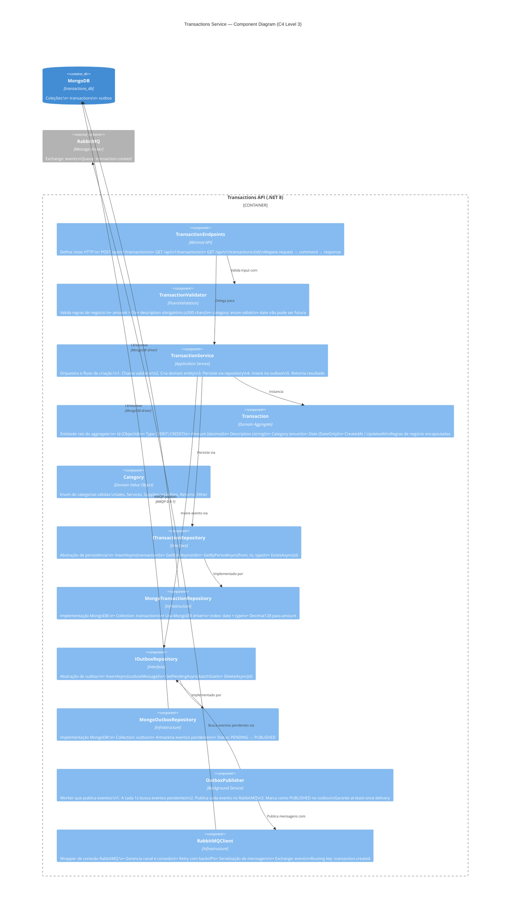
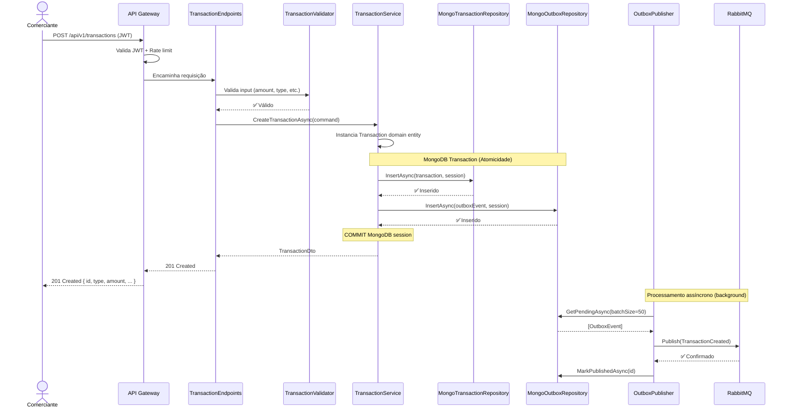
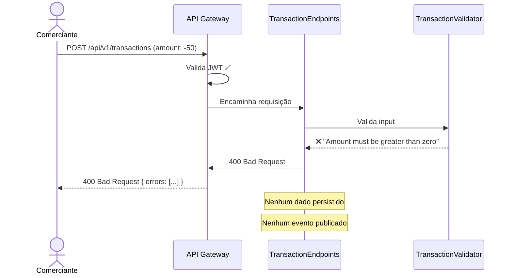
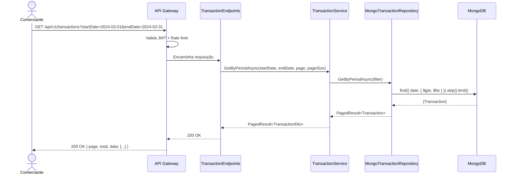

# 03 — Component Diagram: Transactions Service (C4 Level 3)

## Visão Geral

O **Transactions Service** é responsável por registrar e consultar lançamentos financeiros (débitos e créditos). Este diagrama detalha os **componentes internos** do serviço, suas responsabilidades e como se relacionam.

A arquitetura segue um modelo **Clean Architecture simplificado** com três camadas:
- **API Layer** — Endpoints, validação, serialização
- **Application Layer** — Orquestração de regras de negócio
- **Infrastructure Layer** — Persistência e mensageria

---

## Diagrama



---

## Descrição dos Componentes

### API Layer

#### TransactionEndpoints
**Responsabilidade:** Definir e expor rotas HTTP do serviço

- Tecnologia: .NET 8 Minimal APIs (`app.MapPost`, `app.MapGet`)
- Realiza: parsing de request → validação básica → delegação ao service
- Serialização: `System.Text.Json` (AOT-ready)
- Resposta: `IResult` com status codes corretos (201, 400, 404, 401, 500)
- Autenticação: middleware valida JWT antes de chegar ao endpoint

**Rotas:**
```
POST   /api/v1/transactions            → criar lançamento
GET    /api/v1/transactions            → listar por período
GET    /api/v1/transactions/{id}       → detalhe de uma transação
GET    /health                         → health check
GET    /metrics                        → Prometheus metrics
```

---

### Application Layer

#### TransactionValidator
**Responsabilidade:** Validar regras de negócio de input

Tecnologia: FluentValidation

| Campo | Regra | Erro |
|-------|-------|------|
| `amount` | > 0 e não nulo | "Amount must be greater than zero" |
| `type` | DEBIT ou CREDIT | "Transaction type must be DEBIT or CREDIT" |
| `description` | Não vazio, ≤ 500 chars | "Description is required (max 500 chars)" |
| `category` | Enum válido | "Category must be one of: Sales, Services..." |
| `date` | ≤ hoje (sem futuro) | "Transaction date cannot be in the future" |

#### TransactionService
**Responsabilidade:** Orquestrar o registro de lançamento como uma intenção atômica de negócio

O registro de um lançamento é tratado como uma **intenção indivisível**: ou confirma completamente (lançamento registrado + notificação garantida ao serviço de consolidação), ou reverte completamente, sem deixar rastro. Não existe estado intermediário.

```
INTENÇÃO ATÔMICA — Registrar Lançamento:
  1. Validar input → se inválido, rejeita imediatamente (nada persiste)
  2. Construir o lançamento com as regras de domínio
  3. Registrar o lançamento + garantir a notificação de forma indivisível
     → Se qualquer parte falhar: estado anterior é preservado por completo
  4. Confirmar o registro e retornar resultado ao solicitante

A notificação ao serviço de consolidação é parte integrante da intenção,
não um efeito colateral opcional. Um lançamento só é considerado registrado
quando a notificação também está garantida.
```

---

### Domain Layer

#### Transaction (Aggregate Root)
**Responsabilidade:** Encapsular regras de negócio de um lançamento

```csharp
// Estrutura conceitual:
class Transaction {
    ObjectId Id
    string UserId               // Extraído do JWT — quem criou o lançamento (imutável)
    TransactionType Type        // DEBIT | CREDIT
    decimal Amount              // Sempre positivo
    string Description          // Obrigatório, ≤ 500 chars
    Category Category           // Enum
    DateOnly Date               // Sem data futura
    DateTime CreatedAt
    DateTime UpdatedAt
    string Status               // PENDING | CONFIRMED
}
```

> **Nota de Segurança:** `UserId` nunca é aceito como input do cliente. É
> extraído do JWT pelo middleware de autenticação e injetado no comando antes
> de chegar ao aggregate. Ver [ADR-003](../../decisions/ADR-003-user-context-propagation.md).

**Regras encapsuladas:**
- Amount sempre positivo (débito/crédito é pelo `Type`)
- Date nunca pode ser futura
- Imutabilidade: transações com data > 24h não podem ser alteradas

#### Category (Value Object)
Enum de categorias válidas:
- `Sales` — Vendas
- `Services` — Serviços prestados
- `Supplies` — Compra de insumos
- `Utilities` — Utilidades (luz, água, etc.)
- `Returns` — Devoluções
- `Other` — Outros

---

### Infrastructure Layer

#### MongoTransactionRepository
**Responsabilidade:** Persistir e consultar transações no MongoDB

- Collection: `transactions_db.transactions`
- Índices:
  - `date` + `type` (composto) — otimiza consultas por período e tipo
  - `_id` — padrão ObjectId
- Operações:
  - `InsertAsync` — aceita `IClientSessionHandle` (para transação)
  - `GetByIdAsync` — busca por ObjectId
  - `GetByPeriodAsync` — filtro por data + tipo + paginação
- Tipo para `amount`: `Decimal128` (precisão financeira)

#### MongoOutboxRepository
**Responsabilidade:** Gerenciar eventos aguardando publicação

- Collection: `transactions_db.outbox`
- Estrutura do documento:
  ```
  {
    _id: ObjectId,
    eventType: "TransactionCreated",
    payload: { ... },
    status: "PENDING" | "PUBLISHED",
    createdAt: DateTime,
    processedAt: DateTime?
  }
  ```
- Operações:
  - `InsertAsync` — aceita `IClientSessionHandle` (mesma transação)
  - `GetPendingAsync(batchSize)` — busca eventos PENDING em lote
  - `MarkPublishedAsync(id)` — atualiza status para PUBLISHED

#### OutboxPublisher (Background Service)
**Responsabilidade:** Publicar eventos pendentes para o RabbitMQ

**Ciclo:**
```
LOOP a cada 1 segundo:
  1. Buscar até 50 eventos com status PENDING
  2. Para cada evento:
     a. PUBLISH no RabbitMQ
     b. Se sucesso → MARK como PUBLISHED
     c. Se falha → retry com backoff (mantém PENDING)
  3. Aguardar 1 segundo
  4. Repetir
```

**Garantia:** Se o processo reiniciar, os eventos PENDING serão reprocessados — at-least-once delivery.

#### RabbitMQClient
**Responsabilidade:** Abstração de conexão e publicação

- Gerencia pool de conexões e canais
- Retry automático em caso de falha de conexão
- Serialização para JSON (UTF-8)
- Exchange: `events` (type: topic)
- Routing key: `transaction.created`

---

## Fluxos de Sequência

### Fluxo 1: Criar Lançamento (Happy Path)



---

### Fluxo 2: Criar Lançamento (Validação Falha)



---

### Fluxo 3: Consultar Transações por Período



---

## Padrões Aplicados

### Intenção Atômica de Negócio

O registro de um lançamento é tratado como uma **intenção única e indivisível**. Não existe confirmação parcial.

```
┌──────────────────────────────────────────────────────────────────┐
│              REGISTRAR LANÇAMENTO = INTENÇÃO ÚNICA               │
├──────────────────────────────────────────────────────────────────┤
│                                                                  │
│  Validar ──► Registrar ──► Garantir Notificação ──► Confirmar   │
│                                                                  │
├──────────────────────────────────────────────────────────────────┤
│  SUCESSO → Lançamento registrado + notificação garantida         │
│  FALHA   → Nada persiste. Nada notifica. Estado preservado.      │
└──────────────────────────────────────────────────────────────────┘
```

| Cenário | Resultado |
|---------|-----------|
| Validação falha | Rejeição imediata — nenhum dado alterado |
| Persistência falha | Rollback completo — nenhuma notificação gerada |
| Notificação falha | Rollback completo — lançamento não confirmado |
| Tudo ok | Confirmação — lançamento existe + notificação garantida |

### Outbox Pattern

Garante que o registro do lançamento e o registro da notificação ocorrem como **uma única unidade de trabalho**: ou ambos confirmam, ou nenhum confirma.

```
SEM garantia de atomicidade:
  Registra lançamento → ✅
  Notifica consolidação → ❌ falha de rede
  Resultado: lançamento existe, consolidado nunca atualiza ← INCONSISTÊNCIA

COM garantia de atomicidade (Outbox Pattern):
  [Registra lançamento + Registra notificação pendente] → ✅ ou ❌ juntos
  Mecanismo de retransmissão entrega notificação ao broker → eventual ✅
  Resultado: consistência garantida mesmo em falhas transitórias
```

- ✅ Falha de rede no broker → notificação permanece pendente para retry
- ✅ Processo reinicia → notificações pendentes são reprocessadas
- ✅ Lançamento nunca existe sem notificação correspondente garantida

### Separação de Responsabilidades

| Componente | Responsabilidade | NÃO faz |
|-----------|-----------------|---------|
| `TransactionEndpoints` | Entrada HTTP — recebe e devolve | Regras de negócio |
| `TransactionValidator` | Validação de regras de input | Persistência |
| `TransactionService` | Orquestração da intenção atômica | Detalhes de infraestrutura |
| `Transaction` | Regras e invariantes de domínio | Persistência |
| `MongoTransactionRepository` | Persistência do lançamento | Regras de negócio |
| `OutboxPublisher` | Retransmissão confiável ao broker | Lógica de negócio |

---

**Próximo documento:** `docs/architecture/04-component-consolidation.md` (C4 Level 3 — Consolidation Service + Worker)
