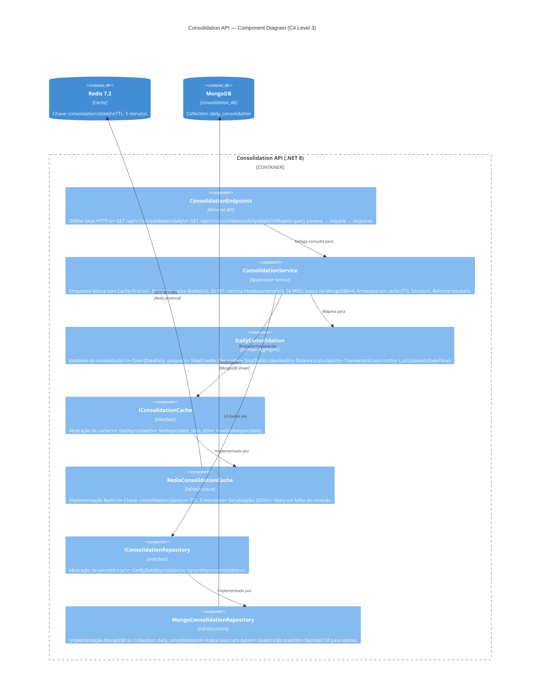
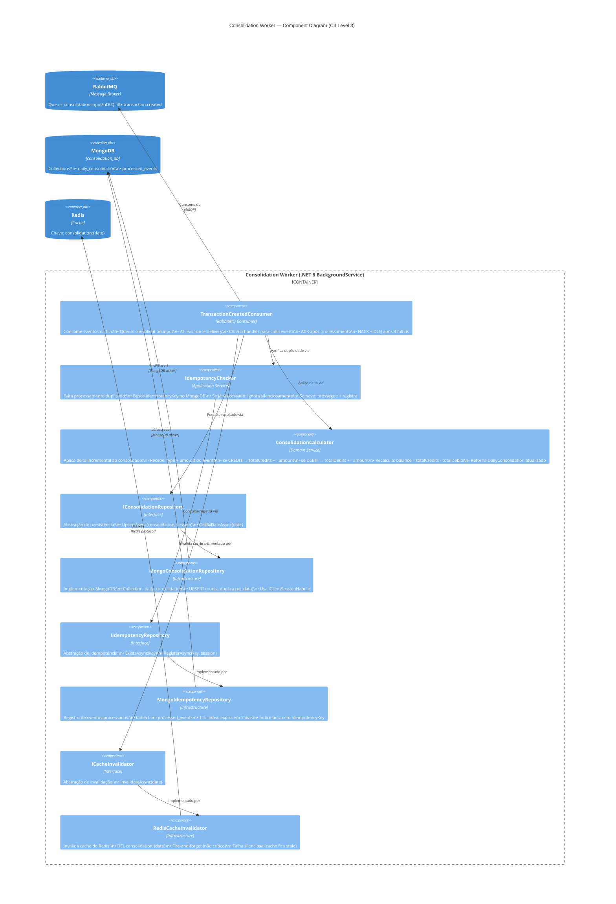
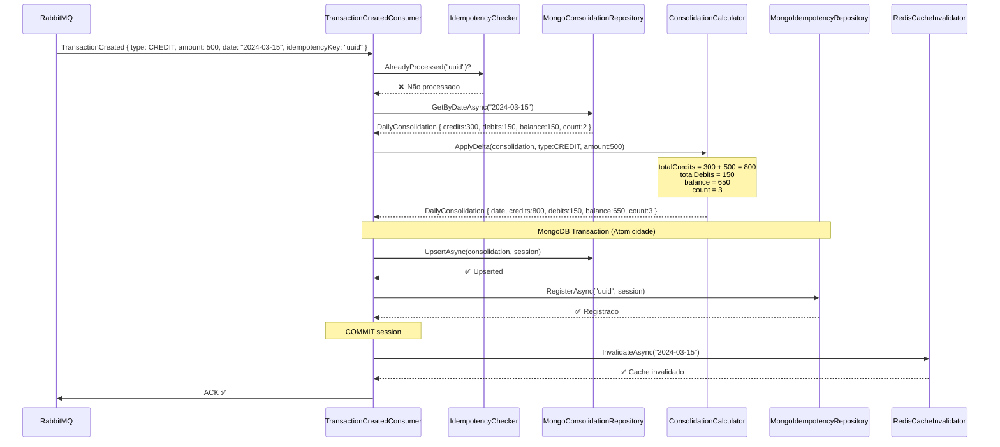
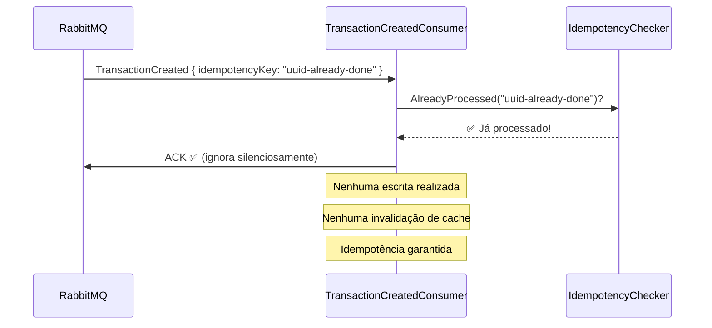
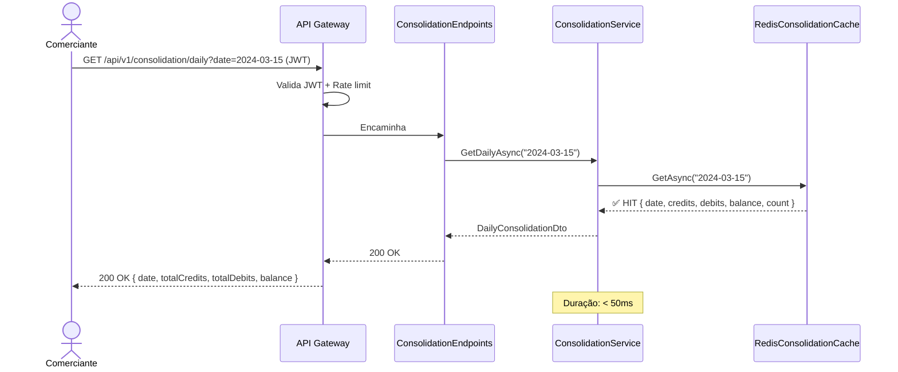
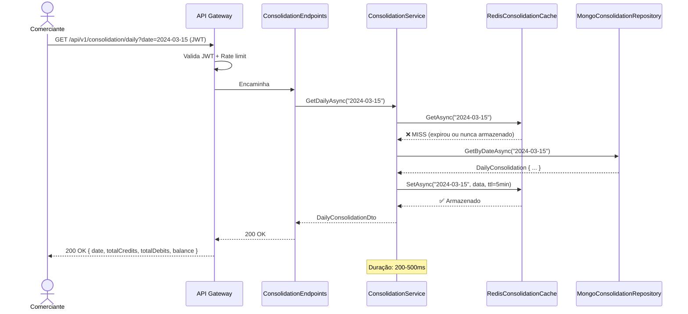
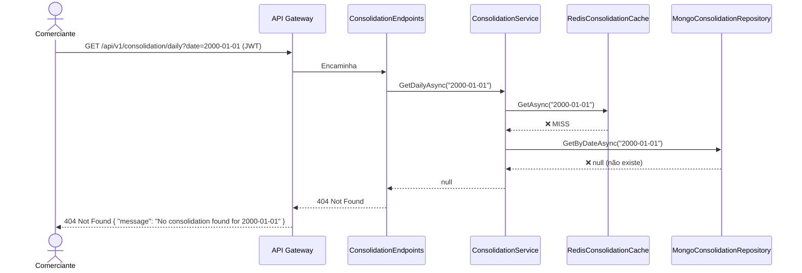

# 04 — Component Diagram: Consolidation Service + Worker (C4 Level 3)

## Visão Geral

O **Consolidation Service** é composto por **dois containers** com responsabilidades distintas:

- **Consolidation API** — Serviço de **leitura** (consulta de saldo diário consolidado). Usa padrão Cache-First com Redis.
- **Consolidation Worker** — Serviço de **processamento assíncrono**. Consome eventos do RabbitMQ e recalcula saldo.

Os dois compartilham o mesmo banco de dados (`consolidation_db`) mas são deployados de forma independente, o que garante o requisito de isolamento de falhas.

---

## Diagrama — Consolidation API



---

## Diagrama — Consolidation Worker



---

## Descrição dos Componentes

### Consolidation API — Componentes

#### ConsolidationEndpoints
**Responsabilidade:** Expor rotas HTTP de consulta de saldo

- Tecnologia: .NET 8 Minimal APIs
- Aceita parâmetro `date` (query param ou path param)
- Valida formato de data e que não é data futura
- Delega ao `ConsolidationService`

**Rotas:**
```
GET  /api/v1/consolidation/daily?date=YYYY-MM-DD    → saldo de data específica
GET  /api/v1/consolidation/daily/{date}             → versão alternativa
GET  /health                                         → health check
GET  /metrics                                        → Prometheus metrics
```

---

#### ConsolidationService
**Responsabilidade:** Orquestrar consulta de saldo com Cache-First

```
FLUXO (Cache-First):
  1. Buscar em Redis: GET consolidation:2024-03-15
  2. HIT → retornar imediatamente (< 50ms)
  3. MISS:
     a. Buscar em MongoDB: daily_consolidation WHERE date = '2024-03-15'
     b. Encontrado → SET Redis com TTL 5min
     c. Não encontrado → 404 Not Found
  4. Retornar DailyConsolidationDto
```

---

#### DailyConsolidation (Domain Aggregate)
**Responsabilidade:** Representar o saldo consolidado de um dia

| Campo | Tipo | Descrição |
|-------|------|-----------|
| `Date` | DateOnly | Data do consolidado (chave única) |
| `TotalCredits` | decimal | Soma de todos os créditos do dia |
| `TotalDebits` | decimal | Soma de todos os débitos do dia |
| `Balance` | decimal | TotalCredits - TotalDebits |
| `TransactionCount` | int | Quantidade de lançamentos processados |
| `LastUpdated` | DateTime | Último recálculo |

**Invariante:** `Balance = TotalCredits - TotalDebits` (calculado, nunca modificado diretamente)

---

#### RedisConsolidationCache
**Responsabilidade:** Cache de alto desempenho para consultas de saldo

- Chave: `consolidation:{date}` (ex: `consolidation:2024-03-15`)
- TTL: 5 minutos (configurável via `Redis__DefaultExpirationMinutes`)
- Serialização: `System.Text.Json`
- Retry: 2 tentativas com delay 100ms antes de falhar silenciosamente
- Fallback: Se Redis está indisponível, consulta vai direto ao MongoDB

---

### Consolidation Worker — Componentes

#### TransactionCreatedConsumer
**Responsabilidade:** Consumir e orquestrar processamento de eventos

**Ciclo completo de um evento:**
```
1. DEQUEUE mensagem de consolidation.input
   (evento carrega: type, amount, date, idempotencyKey)
2. Verificar idempotência (já processou este evento?)
   ├── SIM → ACK e ignorar
   └── NÃO → prosseguir
3. Ler DailyConsolidation atual de consolidation_db para a data do evento
   (ou criar novo registro com zeros se for o primeiro lançamento do dia)
4. Aplicar delta do evento:
   ├── se type = CREDIT → totalCredits += amount
   └── se type = DEBIT  → totalDebits  += amount
   recalcular: balance = totalCredits - totalDebits
               transactionCount += 1
5. BEGIN MongoDB session
   ├── UPSERT daily_consolidation
   └── INSERT processed_events (idempotência)
6. COMMIT session
7. DEL cache Redis: consolidation:{date}
8. ACK mensagem (sucesso)

EM CASO DE FALHA:
   - NACK com requeue=false
   - Após 3 tentativas: mensagem vai para DLQ
   - Alerta para operação manual
```

---

#### IdempotencyChecker
**Responsabilidade:** Garantir que o mesmo evento não seja processado duas vezes

- Verifica `idempotencyKey` (UUID gerado pelo Transactions Service)
- Armazenado em `consolidation_db.processed_events`
- TTL: 7 dias (via índice TTL no MongoDB)
- **Cenário tratado:** RabbitMQ pode entregar a mesma mensagem mais de uma vez por falha de rede ou reinício do consumer

---

#### ConsolidationCalculator
**Responsabilidade:** Aplicar delta incremental ao consolidado do dia

O Calculator **não lê de nenhum banco**. Recebe os dados do evento e o estado atual do consolidado, aplica a lógica de negócio e retorna o documento atualizado.

**Algoritmo:**
```
ENTRADA:
  evento   = { type: CREDIT|DEBIT, amount: decimal, date: DateOnly }
  atual    = DailyConsolidation atual (ou novo com zeros)

APLICAR DELTA:
  se type = CREDIT → atual.totalCredits += amount
  se type = DEBIT  → atual.totalDebits  += amount
  atual.balance          = atual.totalCredits - atual.totalDebits
  atual.transactionCount += 1
  atual.lastUpdated       = DateTime.UtcNow

RETORNAR DailyConsolidation {
  date, totalCredits, totalDebits, balance, transactionCount, lastUpdated
}
```

**Precisão:** Usa `decimal` (nunca `float`/`double`) para evitar erros de arredondamento financeiro.

**Isolamento:** Este componente opera exclusivamente em `consolidation_db`. O evento `TransactionCreated` carrega todos os dados necessários (type + amount + date), conforme definido em ADR-002.

---

#### RedisCacheInvalidator
**Responsabilidade:** Invalidar cache após recálculo

- Operação: `DEL consolidation:{date}`
- **Fire-and-forget:** Falha de invalidação não aborta o processamento
- **Consequência de falha:** Cache fica stale por no máximo 5 minutos (TTL natural)
- Próxima consulta buscará dados frescos do MongoDB

---

## Fluxos de Sequência

### Fluxo 1: Processar TransactionCreated (Worker)



---

### Fluxo 2: Processar Evento Duplicado (Idempotência)



---

### Fluxo 3: Consultar Saldo (Cache HIT)



---

### Fluxo 4: Consultar Saldo (Cache MISS)



---

### Fluxo 5: Consultar Saldo (Data Não Encontrada)



---

## Isolamento e Resiliência

### Worker DOWN → API continua operando

```
Cenário: Worker está down por 1 hora

Durante o downtime:
  ✅ Consolidation API: Retorna dados do cache/DB (possivelmente defasado)
  ✅ Transactions API: Continua registrando lançamentos normalmente
  ✅ RabbitMQ: Acumula mensagens na fila (consolidation.input)

Quando Worker volta:
  1. Consome todas as mensagens acumuladas (ordem preservada)
  2. IdempotencyChecker garante que duplicatas são ignoradas
  3. Consolidado atualizado em segundos
  4. Cache invalidado automaticamente
```

### Redis DOWN → API degrada graciosamente

```
Cenário: Redis está down

  ✅ ConsolidationService: Detecta falha no cache → vai direto para MongoDB
  ✅ API responde normalmente (mas mais lenta: 200-500ms vs < 50ms)
  ⚠️ Worker: CacheInvalidator falha silenciosamente (fire-and-forget)
  ✅ Quando Redis volta: cache se popula naturalmente na próxima consulta
```

---

## Padrões Aplicados

| Padrão | Onde Aplicado | Benefício |
|--------|--------------|-----------|
| **Cache-First** | ConsolidationService | Latência < 50ms no happy path |
| **At-Least-Once + Idempotência** | Worker + IdempotencyChecker | Segurança de reprocessamento |
| **Upsert** | MongoConsolidationRepository | Uma data = um documento (RN-04) |
| **Fire-and-forget** | RedisCacheInvalidator | Falha de cache não aborta processamento |
| **Event-Carried State Transfer** | TransactionCreatedConsumer | Worker usa dados do evento — sem cross-DB read |
| **Delta Incremental** | ConsolidationCalculator | Atualização eficiente sem recálculo completo |

---

**Próximo documento:** `docs/architecture/06-architectural-patterns.md` (padrões adotados com justificativas)
