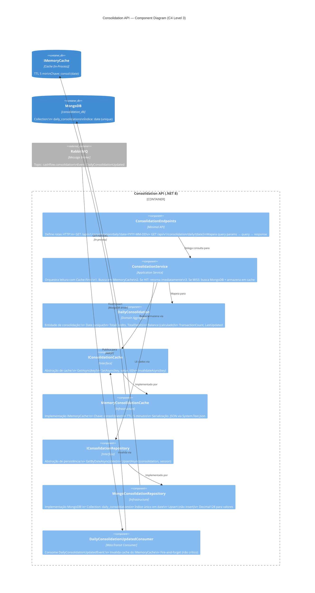
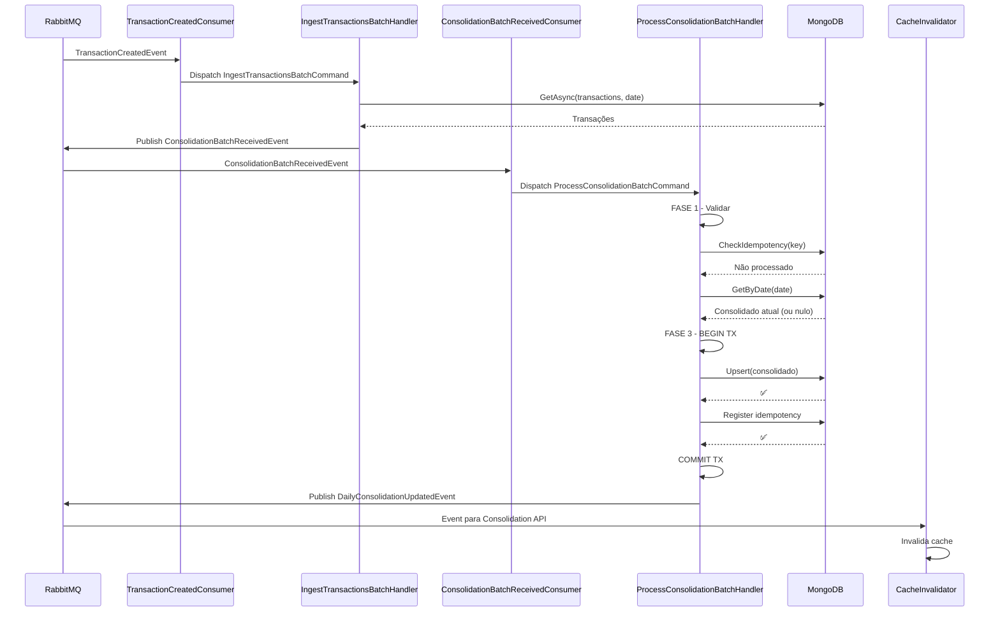

# 04 — Component Diagram: Consolidation Service + Worker (C4 Level 3)

## Visão Geral

O **Consolidation Service** é composto por **dois containers** com responsabilidades distintas:

- **Consolidation API** — Serviço de **leitura** (consulta de saldo diário consolidado). Usa padrão Cache-First com **IMemoryCache** (.NET in-process).
- **Consolidation.Worker** — Serviço de **processamento assíncrono**. Consome eventos do RabbitMQ e recalcula saldo em batch.

Os dois compartilham o mesmo banco de dados (`consolidation_db`) mas são deployados de forma independente, o que garante isolamento de falhas.

---

## Diagrama — Consolidation API



---

## Diagrama — Consolidation.Worker

```mermaid
C4Component
    title Consolidation.Worker — Component Diagram (C4 Level 3)

    Container_Boundary(worker, "Consolidation.Worker (.NET 8 BackgroundService)") {

        Component(txcreated_consumer, "TransactionCreatedConsumer", "MassTransit Consumer", "Consome TransactionCreatedEvent:\n• Queue: consolidation.input\n• Chama IngestTransactionsBatch\n• Publica ConsolidationBatchReceived")

        Component(ingest_cmd, "IngestTransactionsBatchCommand", "MediatR Command", "Acumula transações em lote\nPrepara para consolidação")

        Component(ingest_handler, "IngestTransactionsBatchHandler", "MediatR Handler", "Busca batch de transações\nValida + transforma\nPublica ConsolidationBatchReceivedEvent")

        Component(batch_consumer, "ConsolidationBatchReceivedConsumer", "MassTransit Consumer", "Consome ConsolidationBatchReceivedEvent:\n• Chama ProcessConsolidationBatch\n• Persiste saldo consolidado")

        Component(process_cmd, "ProcessConsolidationBatchCommand", "MediatR Command", "Intenção: processar consolidação")

        Component(process_handler, "ProcessConsolidationBatchHandler", "MediatR Handler", "FASE 1: Valida entrada\nFASE 2: Busca dados históricos\nFASE 3: Calcula + persiste")

        Component(calculator, "ConsolidationCalculator", "Domain Service", "Aplica lógica de cálculo:\nbalance = credits - debits\nTransactionCount += 1")

        Component(idempotency_svc, "IdempotencyService", "Application Service", "Evita reprocessamento:\n• Busca idempotencyKey\n• Se processado: ignora\n• Se novo: registra")

        Component(irepo, "IConsolidationRepository", "Interface", "Abstração de persistência:\n• UpsertAsync(consolidation, session)\n• GetByDateAsync(date)")

        Component(mongorepo, "MongoConsolidationRepository", "Infrastructure", "Implementação MongoDB:\n• Collection: daily_consolidations\n• UPSERT (nunca duplica por date)\n• Session para transação")

        Component(idemp_repo, "IIdempotencyRepository", "Interface", "Abstração de idempotência:\n• ExistsAsync(key)\n• RegisterAsync(key, session)")

        Component(idemp_impl, "MongoIdempotencyRepository", "Infrastructure", "Registro de eventos processados:\n• Collection: processed_events\n• TTL index: 7 dias")

        Component(cache_inv, "ICacheInvalidator", "Interface", "Abstração de invalidação:\n• InvalidateAsync(date)")

        Component(cache_inv_impl, "MemoryCacheInvalidator", "Infrastructure", "Invalida IMemoryCache:\n• DELETE key: consol:{date}\n• Fire-and-forget")

        Component(pub_event, "EventPublisher", "Infrastructure", "Publica DailyConsolidationUpdatedEvent\nPara Consolidation API invalidar cache")
    }

    ContainerDb(consmongo, "MongoDB", "consolidation_db", "Collections:\n• daily_consolidations\n• processed_events")

    Container_Ext(rabbitmq_w, "RabbitMQ", "Message Broker", "Topics:\n• cashflow.transactions\n• cashflow.consolidation")

    Rel(rabbitmq_w, txcreated_consumer, "TransactionCreatedEvent")
    Rel(txcreated_consumer, ingest_cmd, "Dispatch")
    Rel(ingest_cmd, ingest_handler, "Handled by")
    Rel(ingest_handler, irepo, "Busca transações via")
    Rel(ingest_handler, rabbitmq_w, "Publica ConsolidationBatchReceived")

    Rel(rabbitmq_w, batch_consumer, "ConsolidationBatchReceivedEvent")
    Rel(batch_consumer, process_cmd, "Dispatch")
    Rel(process_cmd, process_handler, "Handled by")
    Rel(process_handler, idempotency_svc, "Verifica via")
    Rel(process_handler, irepo, "Lê + escreve via (transação)")
    Rel(process_handler, calculator, "Aplica via")
    Rel(idempotency_svc, idemp_repo, "Consulta/registra via")
    Rel(process_handler, cache_inv, "Invalida via")
    Rel(process_handler, pub_event, "Publica DailyConsolidationUpdated")

    Rel(irepo, mongorepo, "Implementado por")
    Rel(idemp_repo, idemp_impl, "Implementado por")
    Rel(cache_inv, cache_inv_impl, "Implementado por")
    Rel(mongorepo, consmongo, "Lê/escreve", "MongoDB driver")
    Rel(idemp_impl, consmongo, "Lê/escreve", "MongoDB driver")
    Rel(pub_event, rabbitmq_w, "Publica para", "MassTransit")
```



---

## Consolidation API — Componentes

### ConsolidationEndpoints
**Responsabilidade:** Expor rotas HTTP de consulta

- Valida `date` (query param): não pode ser futura
- Delega ao `ConsolidationService`
- Retorna `DailyConsolidationResponse` ou erros (400, 404, 500)

---

### ConsolidationService
**Responsabilidade:** Orquestrar consulta com Cache-First

```
FLUXO:
  1. IMemoryCache.GetAsync("consol:2024-03-15")
  2. HIT → retorna DailyConsolidationResponse
  3. MISS:
     a. IConsolidationRepository.GetByDateAsync("2024-03-15")
     b. Encontrou → IMemoryCache.SetAsync(value, TTL 5min)
     c. Não encontrou → 404 Not Found
  4. Retorna response
```

---

### MemoryConsolidationCache
**Responsabilidade:** Cache in-process via IMemoryCache

- **Tecnologia:** `Microsoft.Extensions.Caching.Memory`
- **Chave:** `consol:{date}` (ex: `consol:2024-03-15`)
- **TTL:** 5 minutos (configurável)
- **Serialização:** JSON via `System.Text.Json`
- **Comportamento:** Per-instance (não compartilhado entre replicas)

**Limitações vs Redis:**
- ✅ < 50ms latência (in-process)
- ❌ Não compartilhado entre múltiplas instâncias
- ❌ Perdido ao reiniciar container

---

### MongoConsolidationRepository
**Responsabilidade:** Persistência de saldos consolidados

- **Collection:** `daily_consolidations`
- **Operações:**
  - `UpsertAsync(consolidation, session)` — insere ou atualiza por date
  - `GetByDateAsync(date)` — retorna `Maybe<DailyConsolidation>`
- **Índice:** unique em `date` (garante uma consolidação por dia)

---

### DailyConsolidationUpdatedConsumer
**Responsabilidade:** Invalida cache quando consolidado é atualizado

- Consome `DailyConsolidationUpdatedEvent` (publicado pelo Worker)
- **Fire-and-forget:** não espera sucesso, falha silenciosa é aceitável
- Invalida chave do cache: `consol:{date}`
- Próxima leitura buscará dados frescos do MongoDB

#### Padrão: Fanout per-Instance (para múltiplas réplicas)

**Problema:** Com múltiplas replicas da API e uma fila compartilhada (`consolidation.api.cache`), apenas **um** pod receberia cada mensagem (competing consumers), deixando os demais com cache stale.

**Solução:** Cada pod cria sua **própria fila** com nome único e a vincula à exchange fanout:

```
EndpointName = "consolidation.api.cache-{Guid.NewGuid():N}"  // ex: consolidation.api.cache-a1b2c3d4e5f6
```

**Características:**
- ✅ Cada pod recebe a mensagem **simultaneamente** (fanout behavior)
- ✅ Fila é **auto-deletada** quando o pod para (`AutoDelete = true`)
- ✅ Fila é **efêmera** (`Durable = false`)
- ✅ Exchange permanece **permanente** (`Durable = true`, `AutoDelete = false`)
- ✅ Retry policy mantido (3 tentativas: 5s, 15s, 30s)

**Topologia RabbitMQ:**
```
Exchange: cashflow.consolidation (fanout, durable=true, permanent)
    │
    ├──► consolidation.updated               (Worker — fila existente)
    ├──► consolidation.api.cache-<id-pod-A> (API pod A — AutoDelete)
    └──► consolidation.api.cache-<id-pod-B> (API pod B — AutoDelete)
```

Cada pod invalida seu próprio `IMemoryCache` local após receber a mensagem.

---

## Consolidation.Worker — Componentes

### TransactionCreatedConsumer
**Responsabilidade:** Consumir `TransactionCreatedEvent` e iniciar acumulação

- **Queue:** `consolidation.input` (RabbitMQ)
- Extrai dados do evento
- Dispatch `IngestTransactionsBatchCommand` via MediatR
- **At-least-once delivery:** pode receber duplicatas

---

### IngestTransactionsBatchCommand
**Responsabilidade:** Intenção de acumular transações em lote

```csharp
public record IngestTransactionsBatchCommand(
    string TracerId,
    string Date,
    List<TransactionData> Transactions) : IRequest<Response>;
```

---

### IngestTransactionsBatchHandler
**Responsabilidade:** Buscar transações e preparar para consolidação

**FASE 1:** Validar entrada
- Null checks, date válida

**FASE 2:** Resolver dependências
- Busca todas as transações da data em `transactions_db.transactions`
- Filtra por `Type` (DEBIT vs CREDIT)
- Prepara batch para cálculo

**FASE 3:** Publicar evento
- Publica `ConsolidationBatchReceivedEvent`
- Encaminha para `ConsolidationBatchReceivedConsumer`

---

### ConsolidationBatchReceivedConsumer
**Responsabilidade:** Consumir evento e processar consolidação

- **Topic:** `cashflow.consolidation`
- Dispatch `ProcessConsolidationBatchCommand` via MediatR
- MassTransit garante **at-least-once delivery**

---

### ProcessConsolidationBatchCommand
**Responsabilidade:** Intenção de processar consolidação

```csharp
public record ProcessConsolidationBatchCommand(
    string TracerId,
    DateTime Date,
    List<TransactionData> Transactions) : IRequest<Response>;
```

---

### ProcessConsolidationBatchHandler
**Responsabilidade:** Processar consolidação atomicamente

**FASE 1 — Validar Inputs:**
- Null checks, date válida

**FASE 2 — Resolver Dependências:**
- `IdempotencyService.CheckAsync(idempotencyKey)` → já processado?
  - ✅ SIM → retorna sucesso (idempotência)
  - ❌ NÃO → prossegue
- `ConsolidationRepository.GetByDateAsync(date)` → consolidado atual
  - Pode ser nulo (primeiro lançamento do dia)

**FASE 3 — Persistir (Transação):**
```
BEGIN MongoDB Transaction
  1. ApplyDelta: ConsolidationCalculator
     └─ Aplica transações ao consolidado
  2. UPSERT: ConsolidationRepository
     └─ Salva saldo atualizado
  3. REGISTER: IdempotencyRepository
     └─ Registra que foi processado (TTL 7 dias)
  4. PUBLISH: EventPublisher
     └─ Publica DailyConsolidationUpdatedEvent
COMMIT
```

Se qualquer etapa falhar → ROLLBACK completo.

---

### ConsolidationCalculator
**Responsabilidade:** Aplicar delta de transações ao consolidado

```csharp
public record ApplyDeltaResult(
    decimal TotalCredits,
    decimal TotalDebits,
    decimal Balance,
    int TransactionCount);

var result = _calculator.ApplyDelta(
    currentConsolidation,
    creditsAmount: 500m,
    debitsAmount: 100m);

// Resultado:
// TotalCredits = 800 (300 anterior + 500 novo)
// TotalDebits = 150
// Balance = 650
// TransactionCount = 3
```

**Algoritmo:**
```
INPUT:
  - consolidadoAtual (ou nulo se primeiro lançamento)
  - transações do dia (list de debits + credits)

PROCESSAR:
  - totalCredits = atual.totalCredits + sum(credits)
  - totalDebits = atual.totalDebits + sum(debits)
  - balance = totalCredits - totalDebits
  - transactionCount = atual.count + list.count

RETORNA:
  - DailyConsolidation atualizado
```

**Precisão:** Usa `decimal` (nunca `float`) para exatidão financeira.

---

### IdempotencyService
**Responsabilidade:** Evitar reprocessamento de eventos duplicados

- Chave idempotência: UUID gerado pelo Transactions Service
- Busca em `processed_events` collection
- Se existe: retorna sucesso (skip processamento)
- Se novo: prossegue para FASE 3, registra depois

**Duração:** Documento em `processed_events` expira em 7 dias (TTL index).

---

### MemoryCacheInvalidator
**Responsabilidade:** Invalidar cache após consolidação

- Operação: `DELETE consol:{date}` do IMemoryCache
- **Fire-and-forget:** se falhar, silenciosamente continua
- **Consequência:** Cache fica stale por no máximo 5 min (TTL natural)
- Próxima leitura do cliente obtém dados frescos do MongoDB

---

## Fluxos de Sequência

### Fluxo 1: Processar TransactionCreatedEvent (Worker)



---

### Fluxo 2: Consultar Consolidado (API - Cache HIT)

```
GET /api/v1/consolidation/daily?date=2024-03-15
  │
  ├─ ConsolidationService.GetDailyAsync()
  │  │
  │  └─ IMemoryCache.GetAsync("consol:2024-03-15")
  │     ✅ HIT! Encontrado (TTL 5min)
  │
  └─ RETURN 200 OK { date, totalCredits, totalDebits, balance }
     Duração: < 50ms
```

---

### Fluxo 3: Consultar Consolidado (API - Cache MISS)

```
GET /api/v1/consolidation/daily?date=2024-03-15
  │
  ├─ ConsolidationService.GetDailyAsync()
  │  │
  │  ├─ IMemoryCache.GetAsync("consol:2024-03-15")
  │  │  ❌ MISS (expirou ou não armazenado)
  │  │
  │  ├─ MongoConsolidationRepository.GetByDateAsync("2024-03-15")
  │  │  ✅ Encontrado em MongoDB
  │  │
  │  ├─ IMemoryCache.SetAsync(value, TTL: 5min)
  │  │  ✅ Armazenado
  │  │
  │  └─ RETURN 200 OK { date, totalCredits, totalDebits, balance }
  │     Duração: 200-500ms
```

---

## Isolamento e Resiliência

### Worker DOWN → API continua operando

```
Consolidation.Worker está down (1 hora)

DURANTE o downtime:
  ✅ Consolidation API: Retorna dados do cache/DB (possivelmente defasado)
  ✅ Transactions API: Continua registrando lançamentos normalmente
  ✅ RabbitMQ: Acumula mensagens na fila (consolidation.input)

QUANDO Worker volta:
  1. Consome mensagens acumuladas (ordem preservada)
  2. IdempotencyChecker ignora duplicatas
  3. Consolidado atualizado em segundos
  4. DailyConsolidationUpdatedConsumer (API) invalida cache
```

### IMemoryCache DOWN → API degrada graciosamente

```
IMemoryCache falha (improvável, está in-process)

CONSEQUÊNCIA:
  ✅ ConsolidationService: Detecta cache miss
  ✅ Fallback para MongoDB: busca dados (mais lento)
  ✅ API responde normalmente, mas com latência 200-500ms vs <50ms
  ✅ Cache se repopula na próxima leitura bem-sucedida
```

---

## Padrões Aplicados

| Padrão | Onde | Benefício |
|--------|------|-----------|
| **Cache-First** | ConsolidationService | < 50ms latência no happy path |
| **At-Least-Once + Idempotência** | Worker | Safety em reprocessamento |
| **Upsert** | MongoConsolidationRepository | Uma data = um documento |
| **Fire-and-Forget** | CacheInvalidator | Falha de cache não aborta flow |
| **Event-Carried State Transfer** | Worker consume do evento | Sem cross-DB reads |
| **Delta Incremental** | ConsolidationCalculator | Atualização eficiente |

---

**Próximo documento:** `docs/security/01-security-architecture.md` (atualização)
